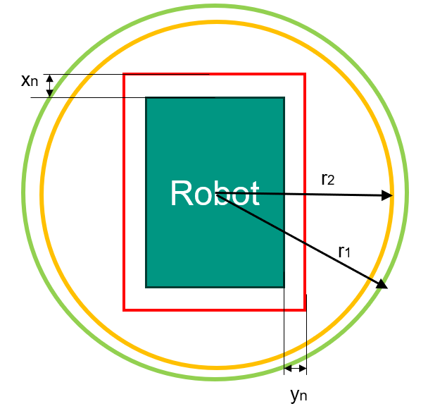

# Motion Control – Task Group Work

After the individual phase, your system already has the basic functions, including: 

* Communicating with the fleet management
* Navigating the mobile robot to follow assigned routes

Now, you will work together to control the real robots.

## Preview mode
Open the Markdown file in Preview mode for a better reading experience.
*  Open the Markdown file in VS Code and make sure it is the active tab. Then press `Ctrl + Shift + V` to open the Preview and view the content with proper formatting.

## Goal
Develop the controller to execute the transportation orders from the fleet manager in the IMRL test area. Packages will be transported between the transfer stations using vehicle-type-specific paths and
docking orientations.


### Task Description

* Task 1: Complete the Individual Work
* Task 2: Presentation of the concept and the collaboration (Milestone 2)
* Task 3: Path Following with Safety Integration
* Task 4: Communicate with the conveyor (the transfer behavior)
* Task 5: Docking and undocking
* Task 6: Real-world testing together with the fleet management team
* Task 7: Showcasing Motion Control of Two Mobile Robots with VDA 5050 (Final Event)


---

## General Notes
* To execute orders, several `behaviors` need to be performed, including `path following`, `docking`, `undocking`, and `transfer`. Note that these behaviors should be distinguished from the `actions` defined by the fleet management system.
* Since different behaviors require different levels of control accuracy, we divide the motion control process into two operating modes: `Normal` and `Fine` Mode. You can find more details about the two modes in the task descriptions.
* For convenience, we use only one mqtt broker for all the robots and conveyors. Connect with the imrl broker:  ip `172.22.222.238`.
* To control the robot, publish message on the topic `KIT/IMRL/{ROS_HOSTNAME}/cmd`:
    - JSON message:
    ```
    {
        "linear": {"x": float},
        "angular": {"z": float}
    }
    ```
    - Description: 
      - You need to give the linear speed (m/s) and angular speed (Rad/s). 
      - `ROS_HOSTNAME` is `mouse001` or `cat001`.
      - The maximum speed should be strictly limited to 0.3 m/s and 1 rad/s in `Normal` Mode, and 0.1 m/s and 0.5 rad/s in `Fine` Mode.
* In the normal mode, you will get the robot's pose from the topic `KIT/IMRL/{ROS_HOSTNAME}/pose`: 
    - JSON message:
      ```
      {
        "position": 
          {
            "x": float,
            "y": float,
            "z": 0
          },
        "orientation": 
          {
            "x": float,
            "y": float,
            "z": float,
            "w": float
          }
      }
      ```
    - Description:
      This message indicates the robot pose in the map coordinate frame <sup>M</sup>P<sub>R</sub>. The orientation is a quaternion.
* The orders are published on the topic `KIT/IMRL/{ROS_HOSTNAME}/order`.
* The minimum distance between two consecutive nodes is **1.25 m**.
* Always try to reduce the control error.
* Coordinate with the management teams to ensure that real-world testing works at the final event.

---

# Tasks

## Task 1: Finalize the control concept

### Goal
Discuss your control concept in the group and merge them into a single shared codebase
that serves as the starting point for all group work tasks.

### To-Dos
* Help each other complete tasks from the individual part.
* Discuss your control concepts and choose the best one.
* Create a new branch as shared codebase.
* Work as a team for the remaining tasks.

### Note
The `Task 2` should be finished before the milestone2. Arrange your time carefully.

---

## Task 2: Presentation of the Concept and Collaboration (Milestone 2)

### Goal
You will give a presentation at the milestone 2.

### Presentation Format

* Team presentation (~10 minutes)
* Prepare slides
* All team members should participate

### Presentation Contents

#### Team & Roles

Introduce team members and their responsibilities

#### Collaboration

Describe:

* Workflow
* Tools
* Coordination methods

#### Progress

Show your current achievements

#### Concept

Present your design of the whole motion control system and explain the key design choices

#### Goals

Define the objectives for the final event

### To-dos
* Prepare for the presentation
  * Your group needs to fully understand the task 3, 4 and 5.

---


## Task 3: Path Following with Safety Integration

### Goal
The most fundamental behavior of a mobile robot is the `path following`. In this task, the robot should autonomously drive through all released nodes in sequence. This functionality should already be available if Task 1 has been completed successfully.

You will now deploy and test your implementation on the real mobile robot. To ensure safe operation, the robot is equipped with a LiDAR-based safety perception module. This module continuously monitors the environment and publishes the current safety status via an MQTT topic.

Before executing any motion command, your software must check the safety status received from the MQTT topic. Motion commands should only be executed when the safety status indicates that it is safe for the robot to move. Integrate this safety mechanism into your path-following implementation before conducting experiments on the real robot.

### Safety Status
The safety status is published on: `KIT/IMRL/{ROS_HOSTNAME}/safety`, where `ROS_HOSTNAME` can be `mouse001` or `cat001`. The JSON message is defined as:
- JSON message:
  ```
  {
    "safety_status": int
  }
  ```

There are six safety statuses (from 0 to 5) defined. 

#### Safety Status Definition

The robot has a length of 69 cm and a width of 56 cm.
The safety zones corresponding to Safety Status 1 and Safety Status 2 are modeled as circular regions with radii r<sub>1</sub> and r<sub>2</sub>, respectively.
The safety zones corresponding to Safety States 3, 4, and 5 are modeled as bounding boxes around the robot. The bounding boxes extend beyond the robot boundary by (x<sub>3</sub>, y<sub>3</sub>), (x<sub>4</sub>, y<sub>4</sub>), and (x<sub>5</sub>, y<sub>5</sub>), respectively.

| Value | Size                                                                       |
| ----- | ---------------------------------------------------------------------------   |
| 0     | -                                                                          |
| 1     | r<sub>1</sub> = 72cm                                          |
| 2     | r<sub>2</sub> = 62.5cm             |
| 3     | x<sub>3</sub> = 12 cm, y<sub>3</sub> = 7 cm     |
| 4     | x<sub>4</sub> = 5 cm, y<sub>4</sub> = 5 cm       |
| 5     | x<sub>5</sub> = 3 cm, y<sub>5</sub> = 3 cm    |

The safety statuses have different meanings under the `Normal` and `Fine` mode:
#### Normal mode
| Value | Meaning                                                                       |
| ----- | ---------------------------------------------------------------------------   |
| 0     | free                                                                          |
| 1     | warning (The robot should slow down.)                                          |
| 2     | should stop (You can still control the robot but should stop.)                |
| 3     | emergency stop (The motors are disconnected from the mqtt command topic.)     |
| 4     | irrelevant for this mode                                                      |
| 5     | irrelevant for this mode                                                      |

#### Fine mode
| Value | Meaning                                                                       |
| ----- | ---------------------------------------------------------------------------   |
| 0     | free                                                                          |
| 1     | free                                                                          |
| 2     | free                                                                          |
| 3     | warning (The robot should slow down.)                                          |
| 4     | should stop (You can still control the robot but should stop.)                |
| 5     | emergency stop (The motors are disconnected from the mqtt command topic.)     |

#### Note

* If the emergency stop is triggered, manually move the vehicle away from obstacles before continuing the test.
* If you believe that the bounding box sizes for status 4 and status 5 are not appropriate, please contact your lab supervisor to discuss and adjust the corresponding dimensions.


### To-dos

* Build safety functions based on the safety state.
* Validate your safety function under normal mode
  * Design some test orders
    * Since we don't know how many teams will use the test area at the same time. We only offer a template (`orders/order_template.json`). Use it to design some test orders. Make sure there is no overlapping in the paths if two teams are testing the code.
  * Drive the robot to the first Node.
  * Use MQTT-Explorer to publish the order in the JSON file to the topic `KIT/IMRL/{ROS_HOSTNAME}/order`  
  * During the driving, put some objects on the route and then remove them to test your safety function.

---

## Task 4: Communicate with the conveyor (the transfer behavior)
### Goal
Control the conveyors on the robot and conveyor station to transfer packages.

### Communicate with the conveyor


#### get state from state topic
- topic: `KIT/IMRL/{name}/conveyor/state`, name: mouse001, cat001, station001, station002
  - message JSON:
    ```
    {
      "running": bool,
      "sensor_a": bool,
      "sensor_b": bool
    }
  ```
  - Description: 
    - `running` is currently not implemented for the lab.
    - `sensor_a` and `sensor_b` indicate if object is detected between the sensor and reflector.

#### publish speed
- topic: `KIT/IMRL/{name}/conveyor/speed`, name: mouse001, cat001, station001, station002
- message JSON:
  ```
  {
    "value": float
  }   
  ```
  - Description: value recommended from -0.2 to 0.2, 0.0 is stop.

### To-dos
* Drive the robot manually to a conveyor station and align the robot conveyor with the station conveyor so that they are oriented in the same direction. Maintain a gap of approximately 8 cm between the two conveyors.
* Control the conveyor belts to transfer a box from the mobile robot to the station (the `drop` action) or from the station to the mobile robot (the `pick` action).
  * Put a box on the robot conveyor or station conveyor
  * Hardcode your program to start the transfer behavior. From Task 5, this will be triggered by the action in the order message.
  * Use the sensor reading to decide when to stop the belts.
* Introduce controlled position and orientation errors by slightly moving and rotating the robot before docking. Repeat the transfer operation for different error values and record the results. Determine the maximum positional offset and angular deviation for which the transfer can still be completed successfully. Based on your experiments, estimate the docking pose tolerance required for reliable box transfer between the robot and the station.

---

## Task 5: Docking and undocking
### Goal
Extend your system to execute the docking and undocking behaviors.

### How to Perform Docking
The robot should arrive at the desired docking pose at high accuracy. The tolerance should already be studied during the task 3. Under the nomal mode, the pose of the robot is estimated by amcl with a map of 10 cm resolution. More precise localization is required for the docking and undocking. Therefore, we we provide a fine localization service (`fine_loc`), which uses contour detection ( a white labeled contour marker on the station) to estimate precise relative pose of the robot to the station (marker), denoted by <sup>S</sup>P<sub>R</sub>.


* The docking behavior is triggered by the `init_fine_positioning` action from the order message. An example of this action is:
```
"actions": [
  {
    "actionType": "init_fine_positioning",
    "actionId": "27bf4e78-70b4-4253-8d9d-71756dd41f61",
    "blockingType": "HARD",
    "actionParameters": [
      {
        "key": "init_fine_pos_name",
        "value": "station001_A"
      },
      {
        "key": "init_fine_pos_x",
        "value": 5.61
      },
      {
        "key": "init_fine_pos_y",
        "value": 4.73
      },
      {
        "key": "init_fine_pos_theta",
        "value": 0
      },
      {
        "key": "fine_pos_control_x",
        "value": 0.02
      },
      {
        "key": "fine_pos_control_y",
        "value": 0.0
      },
      {
        "key": "fine_pos_control_theta",
        "value": 0.0
      }
    ]
  }
]
```
  - The parameter under the key `init_fine_pos_name` specifies the `station_id`, which identifies the target conveyor station. In this lab, the following stations are available: `station001_A`, `station001_B`, `station002_A`, `station003_A`. The suffix A or B indicates the side of the conveyor on which the contour marker is mounted. Each station is labeled to identify its A and B sides.
  - The parameters `init_fine_pos_x`, `init_fine_pos_y` and `init_fine_pos_theta` specify the station pose in the map coordinate frame, denoted by <sup>M</sup>P<sub>S</sub>.
  - The parameters `fine_pos_control_x`, `fine_pos_control_y` and `fine_pos_control_theta` specify the docking pose in the station coordinate frame, denoted by <sup>S</sup>P<sub>D</sub>.


* To activate the service, you need to publish the robot's relative pose with respect to the station to the topic: `KIT/IMRL/{ROS_HOSTNAME}/fine_loc/start`:
    - JSON message:
    ```
    {
      "x": float,
      "y": float,
      "theta": float,
      "station_id": string
    }
    ```
    - Description: 
      - The `station_id` can be read from the action.
      - The parameters `x`, `y` and `theta` describe the current pose of the robot in the **station coordinate frame**, , denoted by <sup>S</sup>P<sub>R</sub>. This is used to restrict the searching range for the contour marker. <sup>S</sup>P<sub>R</sub> can be calculated by <sup>M</sup>P<sub>S</sub> from the action and <sup>M</sup>P<sub>R</sub> from the `KIT/IMRL/{ROS_HOSTNAME}/pose` topic.

* After the start message is published, the fine_loc service starts to work. Messages are published on topic `KIT/IMRL/{ROS_HOSTNAME}/fine_loc/pose`:
  - JSON message:
    ```
    {
      "pose": 
        {
          "x": float,
          "y": float,
          "theta": float
        },
      "station_id": string,
      "station_detected": int
    }
    ```
  - Description: 
    - The key "station_detected" can be 0 (not detected), 1 (detected by the front laser), 2 (detected by the rear laser). It doesn't matter which laser detects it.
    - The key "station_id" tells which station is detected. It is specified by the start message.
    - The key "pose" gives the robot pose in the station coordinate frame <sup>S</sup>P<sub>R</sub>.
    - Your controller should drive the mobile robot to the docking pose (minimizing the error between the <sup>S</sup>P<sub>R</sub> and <sup>S</sup>P<sub>D</sub>).
    - Adjust your control concept: Since the robot needs to be very close to the station during the transfer process, the emergency stop mechanism cannot guarantee collision avoidance, especially at higher speeds. Therefore, you must decrease the maximum linear and angular velocities and carefully tune your controller to ensure that the robot can complete the transfer task safely and reliably without collisions.
    - Transform the experimentally determined docking tolerance range into the station coordinate frame. Use this tolerance range as the target region for the docking operation. If the robot cannot reach the tolerance range in a single attempt, implement a refinement strategy to iteratively improve the robot pose until it falls within the acceptable tolerance range

### Adjust your safety concept
After the fine_loc service is stared, our safety is also switched to the fine mode. You also need to adjust your safety concept.

### How to Perform Docking

After the actions at the docking pose are done, the fleet manager may order the robot to drive to other nodes. The robot needs to execute the undocking procedure to switch to the `normal` mode:
- Leave the docking pose: Now the robot should be still in the `fine` mode. You need to drive the robot slowly to leave the docking pose. The easiest way is to use your control concept for the `fine` mode to drive to the next node. You can also drive it until the safety_status is 1 or 0.
- Stop the `fine_loc` service: publish a message on topic `KIT/IMRL/{ROS_HOSTNAME}/fine_loc/stop`:
  - JSON message:
  ```
  {
    "value": bool
  }
  ```
  - Description: If the value is true, the `fine_loc` service is stopped and the safety is switched to the `normal` mode (2 for should stop, 3 for emergency stop).
- Afterwards, the robot can be navigated using your `normal` control concept.


### To-dos
* Extend your code to support switching between the normal localization mode and the fine localization mode.
* You can find four `order_transport_{station}_{A/B}.json` JSON files in the orders folder. Use them to test your implementation. 
  * Drive the robot to the first node.
  * Use MQTT-Explorer to publish the order in the JSON file to the topic `KIT/IMRL/{ROS_HOSTNAME}/order`.
  * Fine tune your control concept for the `fine` mode.

---

## Task 6: Real-World Testing with Fleet Management Teams
Now you have already implemented all necessary behaviors for accomplishing the orders from the fleet management. You need to collaborate with the fleet management teams to prepare for the demonstration at the final event (Task 7) together.

### To-dos
* Work with fleet management teams.
* Adapt your implementation if necessary. For example, you may need to implement support for the action `processing`.
* Coordinate with the fleet management teams to ensure that the `fine_pos_control_xxx` parameters are suitable. 


## Task 7: Showcasing Motion Control of Two Mobile Robots with VDA 5050 (Final Event)

### Goal

Present your work and demonstrate the whole system together with the fleet management team.

### Poster Presentation

You will present your work with a poster. Details will be available on ILIAS.

### Live Demonstration

We have a list of transportation tasks. Together with the fleet management teams, you showcase that the fleet can accomplish all the tasks using the VDA5050 protocol.

